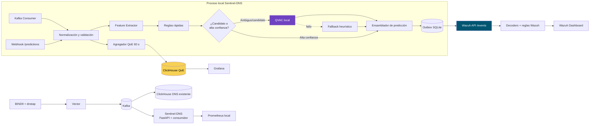
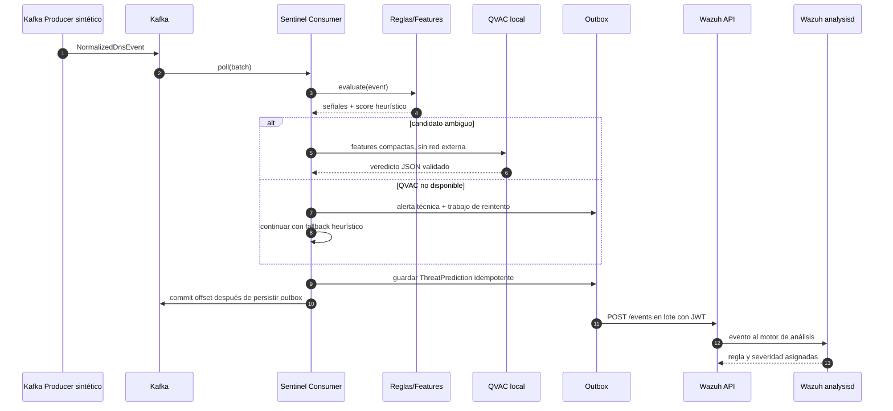
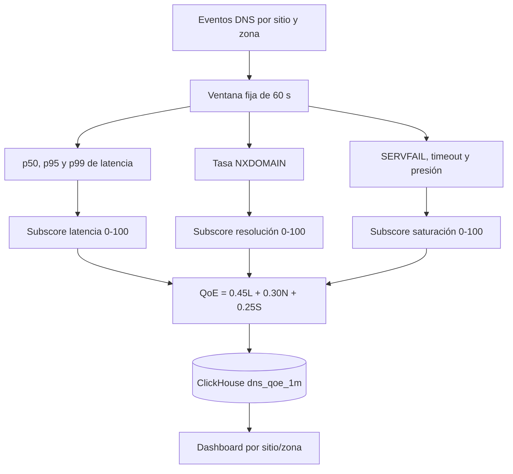
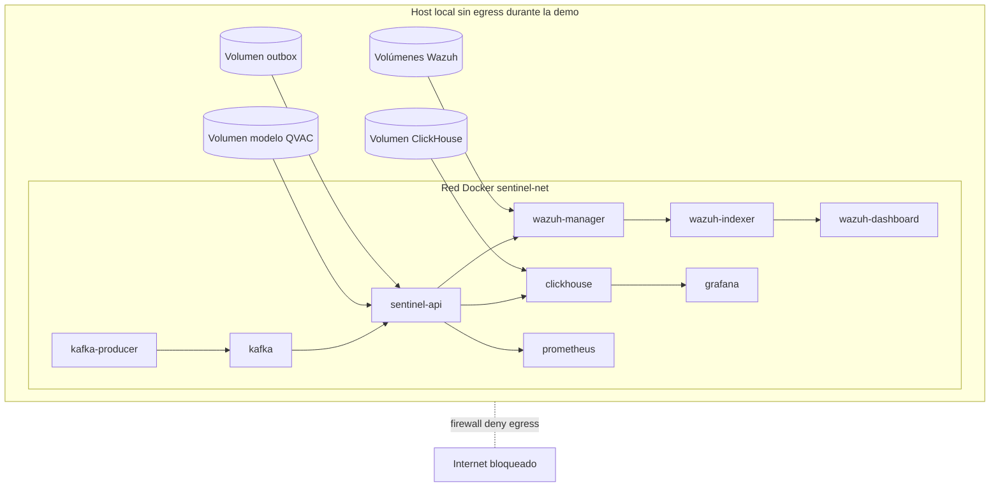
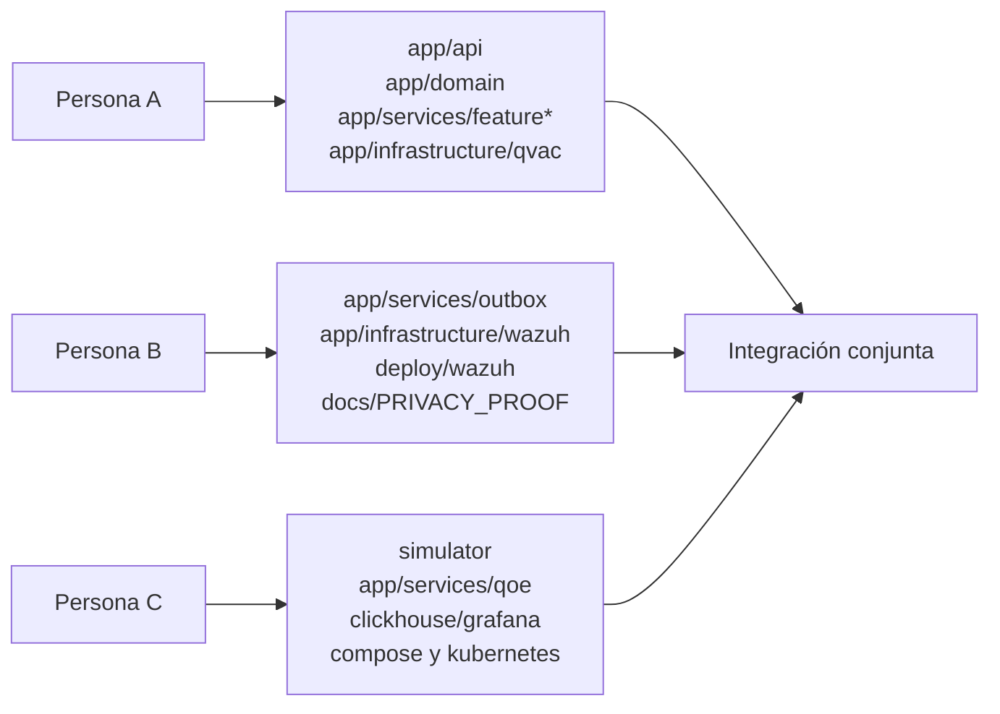

# Spec técnica: Sentinel-DNS con FastAPI, QVAC, Kafka, Wazuh, ClickHouse y Grafana

> **Para:** equipo de implementación y asistente de código  
> **Rol del documento:** planificación de Tech Lead; no contiene implementación de producción  
> **Fecha:** 10 de septiembre de 2026  
> **Equipo:** 3 personas  
> **Entorno ejecutable:** Docker Compose local  
> **Entorno declarativo:** manifiestos Kubernetes validados  

---

## Instrucciones para el equipo o Cursor

- No tomar decisiones de arquitectura fuera de esta spec sin registrarlas como ADR.
- Implementar en el orden indicado y respetar los contratos y nombres definidos.
- Si la versión instalada del SDK Python de QVAC cambia una firma, adaptar únicamente `app/infrastructure/qvac/`; el dominio no debe importar el SDK directamente.
- No agregar endpoints, telemetría o dependencias que envíen información fuera de la infraestructura local.
- No usar servicios SaaS, APIs públicas de reputación, analítica remota ni descarga de modelos durante la ejecución.
- Antes de implementar, cargar como contexto `@docs/TECH_SPEC.md`, `@docs/PRIVACY_PROOF.md`, `@app/domain/schemas.py` y `@app/core/config.py`.
- Ejecutar cada criterio de aceptación antes de declarar terminada una tarea.

La raíz del repositorio debe incluir una `.cursorrules` con la siguiente intención: desarrollador senior, adhesión estricta a la spec, prohibición de cambiar contratos o dependencias sin aprobación y obligación de preguntar cuando exista ambigüedad.

---

## 1. Objetivo

Construir un consumidor adicional del stream DNS que ejecute análisis íntegramente local. Sentinel-DNS consumirá eventos normalizados desde Kafka, calculará señales de amenaza mediante reglas y QVAC, enviará alertas procesables a Wazuh y generará un score de calidad de experiencia por sitio y zona en ClickHouse, visible en Grafana.

FastAPI expondrá un webhook local de predicción para pruebas e integración, además de endpoints de salud y métricas. El procesamiento real de la demostración debe provenir del stream Kafka; el webhook reutilizará exactamente el mismo servicio de predicción y no constituirá un camino alternativo con lógica diferente.

### Resultado observable

1. Un productor sintético publica tráfico DNS normal y malicioso en Kafka.
2. Sentinel-DNS consume el stream en tiempo real sin modificar el pipeline existente.
3. Las detecciones DGA, typosquatting, tunneling y beaconing aparecen en Wazuh.
4. ClickHouse recibe ventanas de QoE y Grafana muestra score, latencia, NXDOMAIN y saturación por sitio y zona.
5. Al interrumpir QVAC, las reglas locales continúan, se registra el fallo para reintento y aparece una alerta técnica en Wazuh.
6. Una prueba automatizada demuestra que el runtime no necesita salida a Internet.

---

## 2. Alcance

### Incluido en el MVP

- Monorepo Python nuevo.
- API FastAPI y consumidor Kafka asíncrono en el mismo artefacto desplegable.
- SDK Python de QVAC detrás de un adaptador.
- Modelo local ligero, precargado en volumen; prohibida su descarga durante runtime.
- Extracción de características DNS y motor híbrido reglas + QVAC.
- Webhook local `POST /api/v1/predictions` para eventos individuales o lotes pequeños.
- Productor de datos sintéticos con perfiles por zona.
- Wazuh manager, indexer y dashboard en el entorno local.
- Ingesta a Wazuh mediante su API local `POST /events` con JWT, batching y RBAC de mínimo privilegio.
- Reglas personalizadas Wazuh para amenazas y fallos operativos.
- ClickHouse con tabla de ventanas QoE.
- Grafana aprovisionado con datasource y dashboard versionado.
- Métricas Prometheus expuestas por FastAPI; Prometheus local para observabilidad técnica.
- Docker Compose completamente ejecutable.
- Manifiestos Kubernetes validados, sin exigencia de ejecutar el clúster durante la demo.
- Tests unitarios, integración y un escenario end-to-end.
- Evidencia documentada de privacidad y operación sin egress.

### Fuera de alcance

- Entrenamiento de un modelo desde cero.
- Datos reales de clientes.
- Bloqueo automático de dominios o cambios en BIND9.
- Alta disponibilidad multi-región.
- Autoscaling calibrado con tráfico real.
- Integraciones cloud o consultas a servicios públicos de reputación.
- Uso de QVAC para clasificación de imágenes; el método `classify` documentado por QVAC es de imagen y no debe confundirse con clasificación de dominios.
- Sustituir Kafka, Vector, ClickHouse, Grafana o Wazuh existentes del pipeline de producción.

---

## 3. Decisiones de arquitectura

| ID | Decisión | Motivo |
|---|---|---|
| ADR-001 | Arquitectura modular por capas dentro de un solo servicio Python | Reduce complejidad operativa para el hackathon sin acoplar dominio e infraestructura. |
| ADR-002 | Kafka es la fuente principal; el webhook es una superficie secundaria | Demuestra análisis sobre stream y evita modificar el pipeline. |
| ADR-003 | Detección híbrida: reglas para todos los eventos y QVAC para candidatos | Mantiene baja latencia, limita carga desconocida y garantiza degradación controlada. |
| ADR-004 | QVAC se integra mediante `QvacInferencePort` | Aísla cambios del SDK y permite un fake determinista en tests. |
| ADR-005 | QVAC usa completion local con salida JSON validada | La clasificación expuesta actualmente por QVAC está orientada a imágenes; un LLM local pequeño puede evaluar features textuales estructuradas. |
| ADR-006 | Wazuh se alimenta con `POST /events` en lotes | Es la interfaz de ingesta soportada y evita confundirla con webhooks salientes del módulo Integrator. |
| ADR-007 | SQLite local funciona como outbox de alertas y reintentos | Permite confirmar offsets Kafka sin perder alertas ante indisponibilidad temporal de QVAC o Wazuh. |
| ADR-008 | QoE se calcula en ventanas fijas de 60 segundos | Es interpretable, fácil de demostrar y suficiente para el MVP. |
| ADR-009 | Docker Compose es el entorno canónico de demo | Permite levantar todo el stack local de forma reproducible. |
| ADR-010 | Kubernetes se entrega con Kustomize y validación estática | Cumple el objetivo solicitado sin convertir la demo en una operación de clúster. |

### Nota sobre QVAC

El SDK Python oficial es asíncrono, requiere Python 3.10 o superior y usa un worker alojado sobre Node.js 22.17 o superior. La imagen de Sentinel-DNS debe contener ambos runtimes y ejecutar una verificación de entorno en CI/build. El modelo debe prepararse antes de activar el modo sin egress.

---

## 4. Arquitectura lógica



### Flujo de una detección



### Flujo QoE



---

## 5. Topología de despliegue



### Puertos locales sugeridos

| Servicio | Puerto host | Exposición |
|---|---:|---|
| FastAPI | 8000 | Solo red local/demo |
| Kafka | 9092 | Solo Docker; host opcional para depuración |
| ClickHouse HTTP | 8123 | Solo Docker o loopback |
| Grafana | 3000 | Loopback/LAN controlada |
| Prometheus | 9090 | Loopback |
| Wazuh API | 55000 | Solo Docker; TLS obligatorio |
| Wazuh Dashboard | 5601 | Loopback/LAN controlada |

No publicar Kafka, ClickHouse ni Wazuh API en `0.0.0.0` fuera del host de demo salvo necesidad explícita. Los manifiestos Kubernetes deben usar `ClusterIP` para servicios internos.

---

## 6. Estructura del repositorio y archivos

```text
sentinel-dns/
├── app/
│   ├── main.py
│   ├── api/
│   │   ├── dependencies.py
│   │   └── routes/{health,predictions,metrics}.py
│   ├── core/{config,logging,lifecycle,security}.py
│   ├── domain/{schemas,enums,ports,errors}.py
│   ├── services/{prediction,feature_extraction,heuristics,qvac_enrichment,qoe,outbox}.py
│   ├── infrastructure/
│   │   ├── kafka/{consumer,producer}.py
│   │   ├── qvac/{client,prompt,parser}.py
│   │   ├── wazuh/{auth,client,dispatcher}.py
│   │   ├── clickhouse/{client,repository}.py
│   │   └── persistence/{sqlite,models}.py
│   └── observability/{metrics,health}.py
├── simulator/{main,profiles,domains,scenarios}.py
├── config/{features,qoe_thresholds,brands}.yaml
├── deploy/
│   ├── docker/
│   ├── kubernetes/{base,overlays/local}/
│   ├── clickhouse/init/
│   ├── grafana/provisioning/
│   ├── prometheus/
│   └── wazuh/
├── scripts/{bootstrap_models,smoke_test,prove_no_egress,validate_manifests}.py
├── tests/{unit,integration,e2e,fixtures}/
├── docs/{TECH_SPEC,PRIVACY_PROOF,DEMO_RUNBOOK,OPERATIONS,ADR}.md
├── .env.example
├── .cursorrules
├── compose.yaml
├── Dockerfile
├── pyproject.toml
├── uv.lock
├── Makefile
└── README.md
```

### Inventario exacto

| Acción | Ruta | Responsabilidad |
|---|---|---|
| CREAR | `.cursorrules` | Reglas de implementación de la spec. |
| CREAR | `.env.example` | Variables sin secretos y valores locales seguros. |
| CREAR | `pyproject.toml` | Metadatos, dependencias, Ruff, MyPy y Pytest. |
| CREAR | `uv.lock` | Versiones exactas probadas. |
| CREAR | `app/main.py` | Construcción de FastAPI; sin lógica de negocio. |
| CREAR | `app/api/dependencies.py` | Inyección de servicios y autenticación del webhook. |
| CREAR | `app/api/routes/health.py` | `/health/live`, `/health/ready`. |
| CREAR | `app/api/routes/predictions.py` | Contrato HTTP de predicciones. |
| CREAR | `app/api/routes/metrics.py` | Exposición de métricas Prometheus. |
| CREAR | `app/core/config.py` | Configuración tipada y validación de modo sin egress. |
| CREAR | `app/core/lifecycle.py` | Inicio/cierre de Kafka, QVAC, outbox y QoE. |
| CREAR | `app/core/logging.py` | Logging JSON con redacción de datos sensibles. |
| CREAR | `app/core/security.py` | Validación de token HMAC/API del webhook. |
| CREAR | `app/domain/schemas.py` | Eventos, features, predicciones, QoE y receipts. |
| CREAR | `app/domain/enums.py` | Amenazas, severidades y estados de servicio. |
| CREAR | `app/domain/ports.py` | Protocolos para QVAC, Wazuh, ClickHouse y outbox. |
| CREAR | `app/domain/errors.py` | Taxonomía de errores recuperables y permanentes. |
| CREAR | `app/services/feature_extraction.py` | Features léxicas, temporales y de flujo. |
| CREAR | `app/services/heuristics.py` | Reglas DGA, typo, túnel y beaconing. |
| CREAR | `app/services/qvac_enrichment.py` | Selección de candidatos y enriquecimiento local. |
| CREAR | `app/services/prediction.py` | Orquestación única para Kafka y webhook. |
| CREAR | `app/services/qoe.py` | Ventanas y score interpretable. |
| CREAR | `app/services/outbox.py` | Persistencia, retry y deduplicación. |
| CREAR | `app/infrastructure/kafka/consumer.py` | Poll, backpressure y commits manuales. |
| CREAR | `app/infrastructure/kafka/producer.py` | Productor usado solo por simulador/tests. |
| CREAR | `app/infrastructure/qvac/client.py` | Ciclo de vida del SDK y completion local. |
| CREAR | `app/infrastructure/qvac/prompt.py` | Prompt versionado y esquema de respuesta. |
| CREAR | `app/infrastructure/qvac/parser.py` | Extracción y validación estricta del JSON. |
| CREAR | `app/infrastructure/wazuh/auth.py` | JWT, renovación y credenciales. |
| CREAR | `app/infrastructure/wazuh/client.py` | Cliente `POST /events`, batches y timeout. |
| CREAR | `app/infrastructure/wazuh/dispatcher.py` | Despacho desde outbox y clasificación de errores. |
| CREAR | `app/infrastructure/clickhouse/client.py` | Pool/cliente y health check. |
| CREAR | `app/infrastructure/clickhouse/repository.py` | Escritura idempotente de ventanas QoE. |
| CREAR | `app/infrastructure/persistence/sqlite.py` | Conexión y migración local de outbox. |
| CREAR | `app/infrastructure/persistence/models.py` | Registros de entrega y reintentos. |
| CREAR | `app/observability/metrics.py` | Contadores, histogramas y gauges. |
| CREAR | `app/observability/health.py` | Estado compuesto de dependencias. |
| CREAR | `simulator/*.py` | Dataset sintético y escenarios reproducibles. |
| CREAR | `config/features.yaml` | Umbrales heurísticos versionados. |
| CREAR | `config/qoe_thresholds.yaml` | Umbrales por zona con defaults. |
| CREAR | `config/brands.yaml` | Marcas ficticias/autorizadas para typo. |
| CREAR | `deploy/clickhouse/init/001_qoe.sql` | Tabla QoE y vistas de consulta. |
| CREAR | `deploy/grafana/provisioning/datasources/clickhouse.yaml` | Datasource local. |
| CREAR | `deploy/grafana/provisioning/dashboards/provider.yaml` | Provisionamiento versionado. |
| CREAR | `deploy/grafana/provisioning/dashboards/sentinel-dns.json` | Dashboard QoE. |
| CREAR | `deploy/prometheus/prometheus.yml` | Scrape del agente. |
| CREAR | `deploy/wazuh/rules/sentinel_dns_rules.xml` | Reglas de seguridad y operación. |
| CREAR | `deploy/wazuh/rbac/sentinel_ingest.json` | Política mínima `event:ingest`. |
| CREAR | `deploy/kubernetes/base/*` | Namespace, workloads, services, config y storage. |
| CREAR | `deploy/kubernetes/overlays/local/*` | Overlay local sin LoadBalancer. |
| CREAR | `compose.yaml` | Stack local y health checks. |
| CREAR | `Dockerfile` | Imagen Python + worker QVAC/Node requerido. |
| CREAR | `scripts/bootstrap_models.py` | Preparación explícita del modelo antes de modo offline. |
| CREAR | `scripts/prove_no_egress.py` | Prueba de inferencia con salida bloqueada. |
| CREAR | `scripts/smoke_test.py` | Verificación end-to-end. |
| CREAR | `scripts/validate_manifests.py` | Render y validación Kubernetes. |
| CREAR | `docs/*.md` | Operación, demo, privacidad y decisiones. |

---

## 7. Contratos HTTP

### `POST /api/v1/predictions`

**Responsabilidad:** aceptar uno o hasta 100 eventos DNS normalizados, ejecutar el mismo `PredictionService` utilizado por Kafka, registrar los resultados en outbox y alimentar el agregador QoE.

**Seguridad:** cabecera `X-Sentinel-Token`; comparación constante; secreto cargado desde archivo/secret, nunca escrito en logs.

**Request conceptual:**

```text
PredictionRequest
  events: list[NormalizedDnsEvent]  # 1..100
  correlation_id: UUID | null
```

**Respuesta `202 Accepted`:**

```text
PredictionReceipt
  correlation_id: UUID
  accepted: int
  rejected: int
  result_ids: list[UUID]
  mode: "qvac" | "hybrid" | "heuristic_fallback"
```

El endpoint devuelve `202` porque la entrega a Wazuh y la persistencia de la ventana QoE son asíncronas. No debe esperar a Wazuh.

### Salud

| Endpoint | Semántica |
|---|---|
| `GET /health/live` | Proceso y event loop responden. |
| `GET /health/ready` | Kafka, outbox y configuración están listos; QVAC degradado no vuelve al servicio no-ready si el fallback está activo. |
| `GET /metrics` | Métricas Prometheus, sin dominios ni identificadores de clientes. |

### Errores HTTP

| Código | Caso |
|---:|---|
| 400 | JSON mal formado. |
| 401 | Token ausente o inválido. |
| 422 | Evento no cumple el esquema. |
| 429 | Cola interna por encima del límite; incluir `Retry-After`. |
| 503 | Outbox no disponible o servicio cerrándose. |

---

## 8. Contratos de funciones y componentes

Las firmas son contratos; la implementación concreta queda a cargo del equipo.

```python
class PredictionService:
    async def process_batch(
        self,
        events: list[NormalizedDnsEvent],
        source: EventSource,
    ) -> list[PredictionResult]: ...
```

Responsabilidad: validar idempotencia, extraer features, ejecutar heurísticas, decidir si invoca QVAC, ensamblar predicción, persistir outbox y entregar eventos al agregador QoE.

```python
class FeatureExtractor:
    def extract(
        self,
        event: NormalizedDnsEvent,
        history: TemporalContext,
    ) -> DnsFeatures: ...
```

Features mínimas: longitud y entropía del dominio, proporción dígitos/vocales/consonantes, número de etiquetas, longitud de subdominio, tipo de consulta, rcode, latencia, tasa por cliente hash, periodicidad, jitter, unicidad de subdominios, bytes estimados y distancia a marcas configuradas.

```python
class HeuristicThreatDetector:
    def evaluate(
        self,
        event: NormalizedDnsEvent,
        features: DnsFeatures,
    ) -> HeuristicVerdict: ...
```

Reglas requeridas:

- DGA: alta entropía, longitud atípica y distribución de caracteres.
- Typosquatting: distancia Damerau-Levenshtein contra marcas ficticias/autorizadas, homoglifos y prefijos/sufijos engañosos.
- Tunneling: subdominios largos y únicos, consultas TXT, alta frecuencia y entropía.
- Beaconing: intervalos periódicos con bajo jitter hacia el mismo dominio.

```python
class QvacInferencePort(Protocol):
    async def start(self) -> None: ...
    async def enrich(self, candidate: QvacCandidate) -> QvacVerdict: ...
    async def health(self) -> DependencyHealth: ...
    async def close(self) -> None: ...
```

El payload hacia QVAC debe contener únicamente features del evento local y campos necesarios; sigue siendo dato derivado y por tanto nunca puede abandonar el host.

```python
class QvacCandidateSelector:
    def should_enrich(self, verdict: HeuristicVerdict) -> bool: ...
```

Política inicial:

- Score heurístico `>= 0.90`: alerta inmediata; enriquecimiento QVAC opcional fuera del hot path.
- Score `0.45..0.89`: solicitar veredicto QVAC.
- Score `< 0.45`: no alertar; actualizar contexto temporal y QoE.
- QVAC con timeout: usar el score heurístico, marcar `degraded=true` y crear/reutilizar alerta técnica agregada.

```python
class QoeAggregator:
    def observe(self, event: NormalizedDnsEvent) -> None: ...
    async def flush_due_windows(self, now: datetime) -> list[QoeWindow]: ...
```

```python
class WazuhEventPort(Protocol):
    async def send_events(self, events: list[str]) -> DeliveryResult: ...
```

Cada elemento enviado a Wazuh debe ser un JSON serializado como string dentro de `{"events": [...]}`. Máximo 100 por lote y ritmo máximo de diseño de 30 requests/minuto.

```python
class OutboxPort(Protocol):
    async def enqueue(self, record: OutboxRecord) -> bool: ...
    async def claim_batch(self, limit: int) -> list[OutboxRecord]: ...
    async def mark_delivered(self, ids: list[UUID]) -> None: ...
    async def reschedule(self, ids: list[UUID], retry_at: datetime, reason: str) -> None: ...
```

```python
class KafkaDnsConsumer:
    async def run(self, handler: BatchHandler) -> None: ...
    async def stop(self) -> None: ...
```

Usar commits manuales. Confirmar offsets solo cuando cada evento haya quedado representado en outbox y/o en el acumulador QoE durable según su resultado.

---

## 9. Modelo de datos

### Evento DNS normalizado

```text
NormalizedDnsEvent
  schema_version: Literal["1.0"]
  event_id: UUID
  event_ts: datetime UTC
  observed_at: datetime UTC
  site_id: str
  zone_id: str
  resolver_id: str
  client_hash: str
  qname: str
  qtype: str
  rcode: str
  latency_ms: float | null
  response_bytes: int | null
  timed_out: bool
  synthetic: Literal[true]
```

Validaciones: `qname` normalizado a minúsculas y sin punto final; IDN convertido a punycode; máximo 253 caracteres; timestamps UTC; latencia no negativa; rechazo obligatorio si `synthetic != true` en el entorno del hackathon.

### Features

```text
DnsFeatures
  domain_entropy: float
  domain_length: int
  label_count: int
  digit_ratio: float
  vowel_ratio: float
  longest_label_length: int
  subdomain_uniqueness_1m: float
  query_rate_1m: float
  interval_mean_ms: float | null
  interval_jitter_ms: float | null
  brand_distance: int | null
  suspicious_qtype: bool
  nxdomain: bool
  resolver_error: bool
```

### Predicción de amenaza

```text
ThreatPrediction
  prediction_id: UUID
  event_id: UUID
  created_at: datetime UTC
  detector_version: str
  model_id: str | null
  threat_type: "dga" | "typosquatting" | "dns_tunneling" | "beaconing" | "none"
  confidence: float  # 0..1
  severity: "low" | "medium" | "high" | "critical"
  reasons: list[str]
  heuristic_score: float
  qvac_score: float | null
  degraded: bool
  site_id: str
  zone_id: str
  client_hash: str
  qname: str
```

### Evento Wazuh

```text
WazuhThreatEvent
  integration: "sentinel-dns"
  event_type: "dns_threat" | "sentinel_operational"
  event_id: UUID
  timestamp: datetime UTC
  site: str
  zone: str
  dns.qname: str
  threat.type: str
  threat.confidence: float
  threat.severity: str
  threat.reasons: list[str]
  detector.runtime: "qvac-local" | "heuristic-fallback"
  detector.version: str
```

No incluir IP real, nombre de persona, payload DNS completo ni prompt QVAC en logs operativos.

### Tabla ClickHouse `sentinel_dns.dns_qoe_1m`

| Columna | Tipo sugerido | Uso |
|---|---|---|
| `window_start` | `DateTime64(3, 'UTC')` | Inicio de ventana. |
| `site_id` | `LowCardinality(String)` | Filtro de POP/sitio. |
| `zone_id` | `LowCardinality(String)` | Filtro de zona cliente. |
| `sample_count` | `UInt64` | Confianza del score. |
| `latency_p50_ms` | `Float32` | Tendencia central. |
| `latency_p95_ms` | `Float32` | Experiencia degradada. |
| `latency_p99_ms` | `Float32` | Cola extrema. |
| `nxdomain_rate` | `Float32` | Fallos NXDOMAIN. |
| `servfail_rate` | `Float32` | Fallos del resolver. |
| `timeout_rate` | `Float32` | Pérdida/saturación. |
| `saturation_index` | `Float32` | Señal normalizada 0..1. |
| `latency_score` | `Float32` | Subscore 0..100. |
| `resolution_score` | `Float32` | Subscore 0..100. |
| `saturation_score` | `Float32` | Subscore 0..100. |
| `qoe_score` | `Float32` | Score final 0..100. |
| `status` | `Enum8` | `good`, `warning`, `critical`, `insufficient_data`. |
| `primary_cause` | `LowCardinality(String)` | Explicación principal. |
| `calculation_version` | `LowCardinality(String)` | Auditoría. |
| `updated_at` | `DateTime64(3, 'UTC')` | Reemplazo idempotente. |

Motor sugerido: `ReplacingMergeTree(updated_at)`, ordenado por `(site_id, zone_id, window_start)`.

### Fórmula QoE v1

```text
latency_score    = 100 - normalize(p95, good=100 ms, critical=500 ms)
resolution_score = 100 - normalize(nxdomain_rate, good=2%, critical=20%)
saturation_score = 100 - max(
    normalize(servfail_rate, good=0.5%, critical=10%),
    normalize(timeout_rate, good=0.5%, critical=10%),
    normalize(p99/p50, good=2, critical=8)
)

qoe_score = 0.45 * latency_score
          + 0.30 * resolution_score
          + 0.25 * saturation_score
```

Todos los umbrales deben residir en `config/qoe_thresholds.yaml`, no en el código. Estados: `good >= 85`, `warning 60..84.99`, `critical < 60`; si hay menos de 20 muestras, usar `insufficient_data` y no colorear como falla.

`primary_cause` debe ser el subscore más bajo, traducido a una etiqueta operacional: `latencia_alta`, `nxdomain_elevado`, `saturacion_probable` o `muestras_insuficientes`.

---

## 10. Integración con Wazuh

### Flujo de autenticación y envío

1. Al iniciar el dispatcher, autenticar la cuenta técnica contra `POST /security/user/authenticate`.
2. Mantener el JWT únicamente en memoria.
3. Renovarlo antes de expirar o después de un `401`, con un solo reintento de autenticación.
4. Leer hasta 100 registros pendientes del outbox.
5. Serializar cada alerta como un string JSON dentro del array `events`.
6. Enviar a `POST /events` mediante TLS local.
7. Marcar entregados únicamente los elementos aceptados.
8. Aplicar backoff exponencial con jitter a `429`, `5xx`, timeout o conexión rechazada.
9. En un `4xx` permanente por payload inválido, mover el registro a estado `dead` y generar métrica; no hacer retry infinito.

### RBAC

Crear usuario técnico `sentinel_ingest` y asignarle exclusivamente la acción `event:ingest` sobre `*:*`. Las credenciales se entregan por Docker secret/Kubernetes Secret y nunca forman parte del repositorio.

### Reglas Wazuh requeridas

| Regla | Nivel | Condición |
|---|---:|---|
| `100200` | 7 | Amenaza `medium`. |
| `100201` | 10 | Amenaza `high`. |
| `100202` | 13 | Amenaza `critical`. |
| `100210` | 9 | DNS tunneling con frecuencia o subdominio extremo. |
| `100211` | 9 | Beaconing repetido para un mismo `client_hash` y dominio. |
| `100220` | 6 | QVAC degradado por más de 60 s, alerta agregada. |
| `100221` | 8 | Outbox Wazuh acumulado por encima del umbral. |

Las reglas deben usar el decodificador JSON integrado, campos dinámicos y descripciones que incluyan sitio, zona, tipo, dominio sintético y confianza. Probar cada ejemplo con `wazuh-logtest`.

### Aclaración de webhook

El módulo Wazuh Integrator configura principalmente webhooks **salientes** desde Wazuh. En este diseño, Sentinel-DNS ingresa eventos mediante la API local soportada `POST /events`. El webhook FastAPI es la entrada local de Sentinel-DNS y no sustituye el consumer Kafka.

---

## 11. Dashboard Grafana

### Variables

- `site_id`: todos o un sitio.
- `zone_id`: dependiente del sitio.
- `time_range`: control estándar.
- `calculation_version`: default actual.

### Paneles obligatorios

| Panel | Visualización | Pregunta operacional |
|---|---|---|
| QoE actual por zona | Stat con umbrales | ¿Qué zonas están degradadas ahora? |
| Evolución del QoE | Time series | ¿Cuándo empezó el deterioro? |
| Latencia p50/p95/p99 | Time series | ¿El problema afecta la cola o a todos? |
| NXDOMAIN/SERVFAIL/timeout | Time series porcentual | ¿Qué tipo de fallo domina? |
| Causa principal | Table | ¿Qué debe investigar el operador? |
| Matriz sitio × zona | Heatmap/table | ¿Dónde está concentrado el impacto? |
| Volumen de muestras | Bar/time series | ¿El score tiene suficiente evidencia? |

Cada panel debe incluir unidad, leyenda, umbral y descripción. El score nunca debe mostrarse sin los tres subscores y `sample_count`; esto garantiza interpretabilidad.

### Observabilidad técnica

Prometheus recopilará únicamente métricas agregadas:

- `sentinel_dns_events_total{source,status}`
- `sentinel_dns_predictions_total{threat_type,severity,runtime}`
- `sentinel_dns_processing_seconds`
- `sentinel_dns_qvac_seconds`
- `sentinel_dns_qvac_available`
- `sentinel_dns_kafka_consumer_lag`
- `sentinel_dns_outbox_pending`
- `sentinel_dns_wazuh_delivery_total{status}`
- `sentinel_dns_qoe_flush_total{status}`

No usar `qname`, `client_hash`, `site_id` o `zone_id` como labels Prometheus para evitar cardinalidad y exposición.

---

## 12. Datos sintéticos

El simulador debe aceptar `--scenario`, `--rate`, `--duration`, `--seed`, `--site` y `--zone`.

### Escenarios deterministas

| Escenario | Señal |
|---|---|
| `normal` | Dominios comunes sintéticos, latencia 20–80 ms, NXDOMAIN bajo. |
| `dga_burst` | Dominios de listas públicas redistribuibles o generador equivalente, alta entropía. |
| `typosquatting` | Variantes de marcas ficticias configuradas. |
| `tunneling` | Subdominios largos/únicos, TXT y frecuencia elevada. |
| `beaconing` | Consultas periódicas con jitter bajo. |
| `zone_latency` | p95 progresivo por encima de 500 ms en una zona. |
| `nxdomain_spike` | Tasa NXDOMAIN por encima de 20%. |
| `resolver_saturation` | SERVFAIL, timeout y dispersión p99/p50 alta. |
| `mixed_demo` | Secuencia de todos los anteriores para el video. |

Cada evento debe llevar `synthetic=true` y una etiqueta interna de ground truth que se publique solo en un topic de evaluación, no en el evento analizado por Sentinel-DNS.

---

## 13. Seguridad, privacidad y prueba de no egress

### Controles

- Red Docker interna para datos; solo dashboards y FastAPI se publican al host.
- Política Kubernetes `NetworkPolicy` default-deny egress para Sentinel-DNS, con excepciones DNS internas solo si son imprescindibles y destinos explícitos Kafka/Wazuh/ClickHouse/Prometheus.
- Modelo QVAC almacenado en volumen local de solo lectura.
- `QVAC_CACHE_DIR` apuntando al volumen local.
- Descarga de modelo separada en una fase de bootstrap con red, nunca durante demo/runtime.
- TLS para Wazuh API; CA montada y verificación activada. `verify=false` se permite únicamente en un perfil local marcado como inseguro, nunca como default.
- Secretos por archivos montados, Docker secrets o Kubernetes Secrets.
- Logging estructurado con allowlist de campos; no imprimir prompts ni cuerpos de eventos.
- SBOM y escaneo de imagen si el tiempo lo permite.

### Evidencia verificable

`scripts/prove_no_egress.py` debe ejecutar un escenario con salida a Internet bloqueada y verificar:

1. El modelo QVAC carga desde el volumen local.
2. La predicción retorna sin resolución DNS externa.
3. Kafka, ClickHouse y Wazuh continúan accesibles por red interna.
4. Un intento controlado de conexión pública falla.
5. El resultado se guarda como artefacto de texto con timestamp y hashes de imagen/modelo/configuración.

El video debe mostrar la política de red, ejecutar la prueba y luego demostrar una detección.

---

## 14. Backpressure, consistencia y errores

| Caso | Comportamiento requerido |
|---|---|
| Volumen Kafka superior a capacidad | Pausar particiones, procesar batches limitados y exponer lag; no descartar silenciosamente. |
| Evento duplicado | Deduplicar por `event_id`; no duplicar outbox ni ventana. |
| Evento inválido | Enviar a topic local DLQ con razón; no detener partición. |
| QVAC tarda más que el timeout | Cancelar solicitud, usar fallback y encolar reintento de enriquecimiento. |
| QVAC no inicia | Servicio ready en modo degradado si las reglas y outbox funcionan; alerta técnica agregada. |
| Respuesta QVAC no es JSON válido | Un reintento con prompt de reparación; luego fallback. |
| Wazuh `401` | Renovar JWT una vez; si persiste, reprogramar outbox y alertar por métrica/log. |
| Wazuh `429` | Respetar `Retry-After`; backoff con jitter. |
| Wazuh caído | Mantener outbox durable y continuar consumo hasta límite de disco configurable. |
| ClickHouse caído | Reintentar ventanas idempotentes; no inventar score. |
| Reinicio del agente | Reanudar offsets y entregas pendientes sin duplicados observables. |
| Ventana con pocas muestras | Estado `insufficient_data`; no marcar como crítica. |
| Dominio IDN/malformado | Normalizar punycode o rechazar con razón determinista. |
| Reloj atrasado/futuro | Tolerancia configurable; fuera de ella enviar a DLQ. |
| Outbox al límite | Pausar Kafka y devolver 429 al webhook. |

### Presupuestos iniciales configurables

Como no existe estimación de eventos por segundo, no fijar una promesa de throughput. Adoptar valores iniciales conservadores y ejecutar benchmark:

- Poll Kafka: hasta 500 eventos.
- Concurrencia QVAC: 1 por worker salvo medición que justifique más.
- Timeout QVAC: 1.5 s para enriquecimiento del MVP.
- Cola interna: 5,000 eventos.
- Batch Wazuh: hasta 100 alertas, flush cada 2 s.
- Ventana QoE: 60 s.

Los resultados del benchmark deben documentar eventos/s, p50/p95 de procesamiento, uso de CPU/RAM y lag con QVAC activo/degradado.

---

## 15. Dependencias

Fijar versiones exactas mediante `uv.lock`; la tabla expresa paquetes autorizados, no permiso para usar `latest` en producción.

| Dependencia | Uso |
|---|---|
| Python 3.11 | Runtime del agente. |
| Node.js >= 22.17 | Worker requerido por QVAC Python SDK. |
| `tetherto-qvac-sdk` | Inferencia local QVAC. |
| `fastapi` | Webhook y health API. |
| `uvicorn[standard]` | Servidor ASGI. |
| `pydantic` / `pydantic-settings` | Contratos y configuración. |
| `aiokafka` | Consumidor/productor Kafka asíncrono. |
| `httpx` | Cliente Wazuh local con TLS. |
| `clickhouse-connect` | Escritura y consultas ClickHouse. |
| `aiosqlite` | Outbox local durable. |
| `prometheus-client` | Métricas. |
| `PyYAML` | Umbrales configurables. |
| `rapidfuzz` | Distancia de marcas para typosquatting. |
| `numpy` | Cálculos de entropía, percentiles y jitter. |
| `pytest`, `pytest-asyncio`, `testcontainers` | Pruebas. |
| `ruff`, `mypy` | Calidad estática. |

No incorporar OpenTelemetry exporters cloud, Sentry ni clientes de reputación externos.

---

## 16. Docker Compose

Servicios obligatorios:

1. `kafka` en modo KRaft de un nodo.
2. `kafka-init` para topics `dns.telemetry.normalized`, `sentinel.dns.dlq` y `sentinel.dns.groundtruth`.
3. `sentinel-api` con FastAPI, consumer y worker QVAC.
4. `synthetic-producer` activable por profile `demo`.
5. `clickhouse` con init SQL.
6. `grafana` con provisioning automático.
7. `prometheus`.
8. `wazuh-manager`.
9. `wazuh-indexer`.
10. `wazuh-dashboard`.

Todos deben tener health checks. `sentinel-api` depende de Kafka, outbox y modelo montado; Wazuh y ClickHouse pueden iniciar después porque los sinks reintentan.

Perfiles:

- `core`: Kafka, Sentinel, ClickHouse, Grafana, Prometheus.
- `security`: componentes Wazuh.
- `demo`: productor sintético.
- `full`: composición documentada de todos.

---

## 17. Kubernetes

### Recursos base

- Namespace `sentinel-dns`.
- Deployments/StatefulSets según persistencia.
- Services `ClusterIP`.
- ConfigMaps para features, QoE, Grafana y Prometheus.
- Secrets referenciados, con valores de ejemplo fuera de Git.
- PVCs para modelos QVAC, outbox, ClickHouse, Wazuh e indexer.
- Probes de liveness/readiness.
- Requests/limits documentados y marcados como valores iniciales.
- PodDisruptionBudget solo para Sentinel si se configura más de una réplica en el futuro.
- NetworkPolicies default-deny ingress/egress y allowlists internas.

### Validación requerida

- `kubectl kustomize deploy/kubernetes/overlays/local` produce YAML.
- Validación de esquema con `kubeconform` o equivalente sin errores.
- `kubectl apply --dry-run=client` pasa con el render resultante.
- Escaneo estático confirma que no hay `LoadBalancer`, imágenes `latest`, contenedores privilegiados ni secretos literales.

Kafka, ClickHouse y Wazuh completos en Kubernetes son entregables declarativos; para un entorno real se recomienda sustituirlos por operadores o despliegues institucionales, fuera del MVP.

---

## 18. Estrategia de pruebas

### Unitarias

- Normalización de dominios, IDN y campos límites.
- Entropía, ratios, periodicidad y jitter.
- Cada regla de amenaza con positivos y negativos.
- Fórmula QoE, umbrales y `insufficient_data`.
- Parser de QVAC: JSON válido, truncado, campos extras y score fuera de rango.
- Política de selección de candidatos.
- Backoff y clasificación de errores Wazuh.
- Deduplicación e idempotencia del outbox.

### Integración

- Kafka real mediante contenedor: producción, consumo y commit.
- ClickHouse real: inserción idempotente y consulta por sitio/zona.
- Wazuh: como mínimo contrato HTTP simulado; en perfil full, evento real visible en alertas.
- QVAC: prueba smoke con modelo local; el resto usa fake para reproducibilidad.
- FastAPI: autenticación, batch, 202, 422, 429 y health degradado.

### End-to-end

1. Levantar `full`.
2. Ejecutar escenario `mixed_demo` con seed fija.
3. Esperar confirmación de consumo.
4. Verificar al menos una alerta de cada tipo en Wazuh.
5. Verificar ventanas QoE y cambio de estado en ClickHouse/Grafana.
6. Detener el worker QVAC.
7. Verificar fallback, alerta técnica y continuidad de Kafka.
8. Restaurar QVAC y verificar recuperación automática.
9. Ejecutar prueba sin egress.

### Evaluación de detección

Contra ground truth sintético reportar precisión, recall y matriz de confusión por tipo. No fijar un umbral de aprobación hasta ejecutar la primera línea base; como objetivo de demo, ninguna familia de amenaza debe tener recall inferior a 0.80 en escenarios controlados y la tasa de falsos positivos del tráfico normal debe ser menor a 5%.

---

## 19. Reparto de trabajo para 3 personas

### Propiedad principal

| Persona | Frente | Entregables primarios |
|---|---|---|
| Persona A — Backend/IA | FastAPI, dominio, features, reglas, adaptador QVAC | API, consumer orchestration, predicción híbrida, tests unitarios del detector. |
| Persona B — Seguridad/Wazuh | Outbox, Wazuh API, RBAC, reglas y privacidad | Alertas visibles, retries, prueba sin egress, evidencias de SIEM. |
| Persona C — Datos/Plataforma | Simulador, QoE, ClickHouse, Grafana, Docker y Kubernetes | Stream sintético, dashboard interpretable, Compose, manifiestos validados. |

### Límites de edición para reducir conflictos



`app/domain/schemas.py`, `app/domain/ports.py`, `app/core/config.py`, `compose.yaml` y `pyproject.toml` son archivos compartidos: Persona A crea la primera versión; cambios posteriores requieren revisión de otra persona.

### Work Breakdown Structure

| ID | Responsable | Dependencia | Tarea | Criterio de salida |
|---|---|---|---|---|
| A1 | A | — | Crear esqueleto, contratos y config | MyPy/Ruff pasan; imports por capas. |
| A2 | A | A1 | FastAPI y webhook | Batch 1..100, auth y respuestas definidas. |
| A3 | A | A1 | Features y reglas | Tests por las cuatro amenazas. |
| A4 | A | A3 | Adaptador QVAC | Modelo local carga; respuesta validada. |
| A5 | A | A2,A4 | Consumer y PredictionService | Stream usa mismo servicio que webhook. |
| B1 | B | A1 | Esquema outbox y dispatcher | Reinicio no pierde pendientes. |
| B2 | B | B1 | Auth y cliente Wazuh | Batches, JWT, retry y 429 probados. |
| B3 | B | B2 | Reglas y RBAC Wazuh | Alerta real visible y `wazuh-logtest` pasa. |
| B4 | B | A4 | Controles sin egress | Evidencia reproducible generada. |
| C1 | C | A1 | Kafka y simulador | Escenarios con seed y ground truth. |
| C2 | C | A1 | Agregador QoE | Fórmula y ventanas probadas. |
| C3 | C | C2 | ClickHouse y Grafana | Dashboard aprovisionado sin clics manuales. |
| C4 | C | A5,B3,C3 | Compose full | Un comando levanta la demo. |
| C5 | C | C4 | Kubernetes | Kustomize, kubeconform y dry-run pasan. |
| I1 | Todos | A5,B3,C4 | E2E y tuning | Flujo completo con seed fija. |
| I2 | Todos | I1 | Video y README | Demo menor a 5 minutos reproducible. |

### Revisión cruzada

- A revisa contratos y concurrencia de C.
- B revisa secretos, logs y exposición de red de A/C.
- C revisa reproducibilidad, health checks y documentación de A/B.
- Ninguna persona aprueba sola cambios en su frente antes del freeze.

---

## 20. Orden de implementación y hitos

Debido al plazo, trabajar por cortes verticales y no intentar completar cada subsistema de forma aislada.

```mermaid
gantt
    title Plan acelerado desde T0
    dateFormat  HH:mm
    axisFormat  %H:%M
    section Base
    Contratos y esqueleto          :a1, 00:00, 1h
    Compose mínimo Kafka/CH        :c1, 00:00, 2h
    section Seguridad
    Outbox + Wazuh API             :b1, after a1, 3h
    Reglas Wazuh                   :b2, after b1, 90m
    section IA
    Features + heurísticas         :a2, after a1, 150m
    QVAC + webhook + consumer      :a3, after a2, 150m
    section QoE
    Agregador + ClickHouse         :c2, after c1, 2h
    Grafana provisionado           :c3, after c2, 90m
    section Integración
    E2E + no egress                :i1, after a3, 2h
    Kubernetes validado            :k1, after c3, 90m
    Video + freeze                 :v1, after i1, 90m
```



El Gantt expresa duraciones relativas y trabajo paralelo; adaptar la hora de inicio sin mover el freeze final.

### Secuencia obligatoria

1. Congelar esquemas y puertos del dominio.
2. Crear Compose mínimo con Kafka y ClickHouse.
3. Lograr corte vertical 1: evento sintético → consumer → log de predicción heurística.
4. Lograr corte vertical 2: predicción → outbox → Wazuh visible.
5. Lograr corte vertical 3: evento → ventana QoE → ClickHouse → Grafana.
6. Integrar QVAC local y fallback sin cambiar contratos.
7. Aprovisionar stack full y health checks.
8. Ejecutar E2E, benchmark corto y tuning de thresholds.
9. Validar Kubernetes.
10. Ejecutar prueba sin egress y guardar evidencia.
11. Grabar video con seed fija.
12. Freeze: solo correcciones P0 y documentación.

### Gates

| Gate | Condición para avanzar |
|---|---|
| G1 — Contratos | Schemas y ports revisados por dos personas. |
| G2 — Stream | Evento Kafka produce una predicción; no se usa archivo estático. |
| G3 — Seguridad | Una alerta high aparece en Wazuh con campos correctos. |
| G4 — Experiencia | Grafana explica la caída de una zona con subscores. |
| G5 — Privacidad | Demo completa funciona con egress bloqueado. |
| G6 — Entrega | Compose limpio, manifiestos válidos, README y video <5 min. |

---

## 21. Guion de video, máximo 5 minutos

| Tiempo | Contenido |
|---:|---|
| 0:00–0:30 | Problema, privacidad y diagrama simple. |
| 0:30–1:00 | Stack local levantado y health checks. |
| 1:00–2:00 | Publicar escenario mixed; mostrar Kafka/consumer en vivo. |
| 2:00–3:00 | Mostrar DGA/túnel/beaconing/typo en Wazuh y campos procesables. |
| 3:00–4:00 | Mostrar score QoE por zona, subscores y causa principal en Grafana. |
| 4:00–4:35 | Detener QVAC; demostrar fallback y alerta técnica. |
| 4:35–5:00 | Mostrar egress bloqueado, arquitectura y repositorio. |

No gastar tiempo instalando dependencias ni haciendo clics de configuración. Todo dashboard, datasource y regla debe estar aprovisionado previamente.

---

## 22. Criterios de aceptación

### Funcionales

- [ ] Kafka es la fuente del escenario principal; Sentinel-DNS usa un consumer group propio.
- [ ] El pipeline existente no requiere cambios para añadir el consumidor.
- [ ] El webhook acepta eventos/batches y reutiliza `PredictionService`.
- [ ] QVAC ejecuta localmente desde el SDK Python y un modelo local precargado.
- [ ] Se detectan las cuatro categorías requeridas sobre el stream sintético.
- [ ] Al menos una alerta por categoría llega a Wazuh y dispara una regla personalizada.
- [ ] El evento Wazuh contiene tipo, confianza, severidad, razones, sitio y zona.
- [ ] QoE se calcula cada 60 s y se escribe idempotentemente en ClickHouse.
- [ ] Grafana permite filtrar por sitio y zona y explica el score con subscores.

### Resiliencia

- [ ] QVAC caído activa fallback, retry y alerta técnica sin detener Kafka.
- [ ] Wazuh caído conserva alertas en outbox y las entrega al recuperarse.
- [ ] Duplicar un `event_id` no duplica efectos visibles.
- [ ] Backpressure pausa consumo o retorna 429; no descarta silenciosamente.
- [ ] Reiniciar Sentinel conserva outbox y reanuda consumo.

### Seguridad y privacidad

- [ ] Ningún servicio de inferencia remoto está configurado.
- [ ] El modelo está disponible localmente antes de bloquear egress.
- [ ] La demo end-to-end pasa con salida a Internet bloqueada.
- [ ] Wazuh usa una cuenta con permiso mínimo `event:ingest`.
- [ ] No hay secretos versionados ni dominios/clientes en métricas Prometheus.
- [ ] Logs y evidencia no contienen prompts ni datos DNS innecesarios.

### Calidad y entrega

- [ ] Tests unitarios e integración pasan.
- [ ] Ruff y MyPy pasan.
- [ ] Compose `full` levanta desde un checkout limpio siguiendo README.
- [ ] Dashboard Grafana y reglas Wazuh se aprovisionan automáticamente.
- [ ] Kustomize renderiza; kubeconform y dry-run pasan.
- [ ] README contiene arquitectura, quickstart, troubleshooting y limitaciones.
- [ ] Repositorio accesible al jurado y video menor a cinco minutos antes del plazo.

---

## 23. Riesgos y mitigaciones

| Riesgo | Prob. | Impacto | Mitigación |
|---|---|---|---|
| Imagen QVAC no soporta host/GPU | Media | Alto | Ejecutar `qvac doctor` temprano; CPU fallback; modelo pequeño. |
| QVAC demasiado lento por evento | Alta | Alto | Candidate selector, concurrencia 1, heurísticas para hot path. |
| Descarga del modelo durante demo | Media | Crítico | Bootstrap previo, volumen RO y prueba sin egress. |
| Stack Wazuh consume demasiada RAM | Alta | Alto | Documentar mínimo de host; permitir profile `security`; cerrar apps ajenas. |
| Contratos Kafka desconocidos | Media | Alto | Schema versionado propio y adaptador de normalización; fixture canónico. |
| Score QoE poco creíble | Media | Alto | Mostrar fórmula, subscores, thresholds y sample_count. |
| Duplicados por retries | Media | Medio | event_id, outbox idempotente y ReplacingMergeTree. |
| Tres personas editan Compose/config | Alta | Medio | Propiedad de archivos y revisión cruzada. |
| Kubernetes distrae del MVP | Media | Alto | Solo manifiestos después de Compose E2E estable. |

---

## 24. Fuentes técnicas verificadas

- [QVAC Python SDK](https://docs.qvac.tether.io/python-sdk/): cliente asíncrono, worker y requisitos de Python/Node.
- [QVAC: funcionamiento interno](https://docs.qvac.tether.io/about/how-it-works/): worker único y comunicación local.
- [QVAC system requirements](https://docs.qvac.tether.io/system-requirements/): compatibilidad y `qvac doctor`.
- [Wazuh API reference — `POST /events`](https://documentation.wazuh.com/current/user-manual/api/reference.html): ingesta, JWT, límite de 100 eventos y 30 requests/min.
- [Wazuh JSON decoder](https://documentation.wazuh.com/current/user-manual/ruleset/decoders/json-decoder.html): extracción de campos dinámicos.
- [Wazuh custom integration](https://documentation.wazuh.com/current/user-manual/manager/integration-with-external-apis.html): webhooks salientes mediante Integrator.

---

## 25. Handoff de implementación

Usar este archivo como `docs/TECH_SPEC.md` en el repositorio nuevo. El patrón recomendado es entregar una tarea del WBS por conversación/branch y exigir que cada responsable reporte: archivos cambiados, tests ejecutados, resultados y desviaciones de la spec.

Para revisión posterior del código: **“Dame feedback en texto; no reescribas el código salvo que sea estrictamente necesario.”** Mantener conversaciones separadas por frente reduce contexto y facilita detectar desviaciones.
