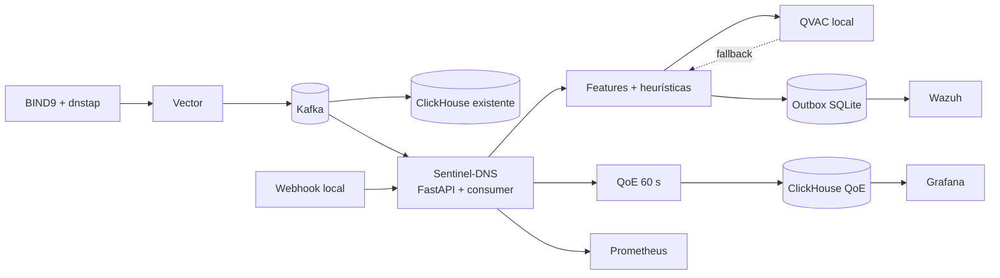

# Sentinel-DNS

Inteligencia local sobre telemetría DNS para detectar amenazas y medir la calidad de experiencia sin enviar consultas ni datos derivados fuera del datacenter.

> **Estado:** MVP ejecutable en Compose (`make up` / `make full`). Kubernetes se valida con Kustomize (ADR-010). El video de demo (I2) y el E2E contra un clúster Wazuh completo siguen abiertos.

## Problema

Ovnicom opera infraestructura de red para clientes regulados de banca, gobierno y salud. Las consultas DNS permiten detectar actividad maliciosa y problemas de resolución, pero también revelan hábitos de navegación. Por esa razón, el procesamiento y la inferencia deben permanecer íntegramente dentro de la infraestructura local.

Sentinel-DNS se conecta como consumidor adicional del stream existente y produce dos resultados:

- **Seguridad:** detección en tiempo real de DGA, typosquatting, DNS tunneling y beaconing/C2, con alertas procesables en Wazuh.
- **Experiencia:** score QoE por sitio y zona basado en latencia, NXDOMAIN y saturación, almacenado en ClickHouse y visualizado en Grafana.

## Principio de privacidad

```text
Consultas DNS + datos derivados + inferencia = infraestructura local
```

- QVAC ejecuta el modelo en el host local.
- No se permiten APIs de inferencia, reputación o telemetría en la nube.
- El modelo se prepara antes del runtime y se monta desde almacenamiento local.
- El entorno de demostración debe funcionar con salida a Internet bloqueada.
- Solo se utilizan datos sintéticos.

La estrategia verificable está documentada en [PRIVACY_PROOF.md](docs/PRIVACY_PROOF.md).

## Arquitectura



Kafka es la fuente principal. El webhook FastAPI utiliza el mismo servicio de predicción y existe para integración y pruebas; no sustituye el procesamiento del stream.

### Detección híbrida

1. Las heurísticas analizan todos los eventos con baja latencia.
2. QVAC local confirma o enriquece candidatos ambiguos.
3. Si QVAC falla, continúan las heurísticas, se programa el reintento y Wazuh recibe una alerta técnica.
4. Una outbox local permite reintentos e idempotencia durante fallos de Wazuh.

## Stack

| Componente | Tecnología | Responsabilidad |
|---|---|---|
| API y agente | Python 3.11, FastAPI, asyncio | Webhook, consumer y orquestación. |
| Inferencia | QVAC Python SDK + worker Node.js | Inferencia local con modelo ligero. |
| Stream | Kafka | Telemetría DNS normalizada. |
| Seguridad | Wazuh | Reglas, severidad, correlación y alertas. |
| Analítica | ClickHouse | Ventanas y score QoE. |
| Visualización | Grafana | Dashboard por sitio y zona. |
| Observabilidad | Prometheus | Salud y métricas técnicas agregadas. |
| Resiliencia | SQLite | Outbox y reintentos locales. |
| Entorno local | Docker Compose | Stack ejecutable de desarrollo/demo. |
| Despliegue declarativo | Kubernetes + Kustomize | Manifiestos validados. |

## Estructura

```text
app/
├── api/                 # FastAPI, dependencias y rutas
├── core/                # Configuración, lifecycle, seguridad y logging
├── domain/              # Schemas, enums, errores y ports
├── services/            # Predicción, heurísticas, QoE y outbox
├── infrastructure/      # Kafka, QVAC, Wazuh, ClickHouse y SQLite
└── observability/       # Health checks y métricas

simulator/               # Generador de tráfico DNS sintético
config/                  # Umbrales de detección y QoE
deploy/                  # Docker, Kubernetes y provisioning
scripts/                 # Bootstrap, smoke, privacidad y validación
tests/                   # Unitarias, integración, E2E y fixtures
docs/                    # Arquitectura, ADR, operación y coordinación
```

## Estado de implementación

- [x] Especificación técnica y decisiones arquitectónicas.
- [x] Contratos de dominio y configuración.
- [x] FastAPI y webhook `POST /api/v1/predictions`.
- [x] Consumer Kafka y simulador sintético.
- [x] Features, heurísticas y adaptador QVAC.
- [x] Outbox e integración Wazuh (reglas JSON decoder; dashboard/indexer en K8s).
- [x] QoE, ClickHouse y Grafana.
- [x] Docker Compose perfiles `core` / `security` / `demo` / `full`.
- [x] Manifiestos Kubernetes validados (C5).
- [ ] Pruebas E2E con Wazuh UI y video <5 min (I1/I2).

## Desarrollo local

### Requisitos

- Python 3.11.
- Node.js 22.17 o superior para el worker QVAC.
- `uv` para dependencias Python.
- Docker con Docker Compose.
- `kubectl` y kubeconform para validar Kubernetes (C5).

### Quickstart

```text
make env          # copia .env.example; rellena SENTINEL_WEBHOOK_TOKEN
make sync
make bootstrap    # una vez, con red; el GGUF queda en data/qvac/
make up           # perfil core
make api          # opcional: API en el host (Kafka en localhost:29092)
```

Demo canónica:

```text
make full         # core + wazuh-manager + simulador mixed_demo
uv run python scripts/smoke_test.py
```

- API: http://127.0.0.1:8000/docs y `/lab`
- Grafana (anónimo Viewer): http://127.0.0.1:3000
- Prometheus: http://127.0.0.1:9090
- Wazuh API: https://localhost:55000 (credenciales en `.env`, no en git). `make wazuh` exporta el cert a `data/wazuh/root-ca.pem`.

El webhook usa `X-Sentinel-Token`. Wazuh recibe `POST /events` con JWT. Las reglas viven en `deploy/wazuh/rules/sentinel_dns_rules.xml` (JSON decoder; 100199 cuelga de la regla stock 86600 porque esa captura todo JSON con `timestamp`+`event_type`).

Kubernetes (sin clúster): `make validate-k8s` o `kubectl kustomize deploy/kubernetes/overlays/local`.

## API prevista

| Método | Ruta | Uso |
|---|---|---|
| `POST` | `/api/v1/predictions` | Acepta 1–100 eventos sintéticos y responde `202`. |
| `GET` | `/health/live` | Estado del proceso y event loop. |
| `GET` | `/health/ready` | Kafka, outbox y configuración disponibles. |
| `GET` | `/metrics` | Métricas Prometheus sin datos DNS sensibles. |

El webhook utilizará `X-Sentinel-Token`. La entrega a Wazuh será asíncrona mediante su API local `POST /events` con JWT y lotes.

## Datos sintéticos

El simulador cubrirá escenarios reproducibles con seed fija:

- tráfico normal;
- ráfaga DGA;
- typosquatting sobre marcas ficticias;
- tunneling mediante subdominios largos y consultas TXT;
- beaconing periódico;
- latencia elevada, NXDOMAIN y saturación por zona;
- escenario combinado para la demostración.

Cada evento del hackathon debe declarar `synthetic=true`. El ground truth se mantiene separado del evento consumido por el detector.

## Trabajo con agentes

Los agentes deben comenzar leyendo [AGENTS.md](AGENTS.md) y tomar una tarea identificada en [WORK_PLAN.md](docs/WORK_PLAN.md). El proyecto se divide en tres frentes:

- **A — Backend/IA:** FastAPI, dominio, heurísticas, QVAC y consumer.
- **B — Seguridad/Wazuh:** outbox, API/RBAC/reglas y privacidad.
- **C — Datos/Plataforma:** simulador, QoE, ClickHouse, Grafana, Docker y Kubernetes.

El protocolo de ownership, revisión y handoff está en [AGENT_WORKFLOW.md](docs/AGENT_WORKFLOW.md). Los criterios obligatorios de cierre están en [DEFINITION_OF_DONE.md](docs/DEFINITION_OF_DONE.md).

## Documentación

- [Especificación completa](PLAN_IMPLEMENTACION_SENTINEL_DNS.md)
- [Índice documental](docs/README.md)
- [Contexto del proyecto](docs/PROJECT_CONTEXT.md)
- [Arquitectura](docs/ARCHITECTURE.md)
- [Decisiones arquitectónicas](docs/ADR.md)
- [Plan de trabajo](docs/WORK_PLAN.md)
- [Privacidad y no egress](docs/PRIVACY_PROOF.md)
- [Operación](docs/OPERATIONS.md)
- [Runbook de demostración](docs/DEMO_RUNBOOK.md)

## Criterios principales del MVP

- La clasificación funciona sobre Kafka.
- Las cuatro familias de amenaza aparecen como alertas procesables en Wazuh.
- El score QoE es interpretable y filtrable por sitio/zona en Grafana.
- La interrupción de QVAC activa fallback sin detener el stream.
- La demo completa funciona sin salida a Internet.
- Docker Compose se levanta de forma reproducible.
- Los manifiestos Kubernetes pasan render, validación de esquema y dry-run.

## Referencias

- [QVAC Python SDK](https://docs.qvac.tether.io/python-sdk/)
- [Requisitos de QVAC](https://docs.qvac.tether.io/system-requirements/)
- [Wazuh API](https://documentation.wazuh.com/current/user-manual/api/reference.html)
- [Decodificador JSON de Wazuh](https://documentation.wazuh.com/current/user-manual/ruleset/decoders/json-decoder.html)

## Licencia

Pendiente de definición por el equipo antes de publicar el repositorio.
