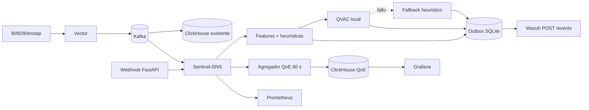
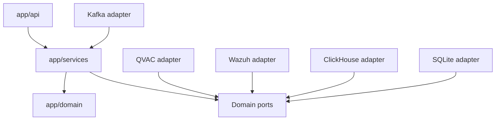

# Arquitectura resumida

## Vista general

## Seguridad

1. Kafka entrega `NormalizedDnsEvent` al consumer group propio.
2. Se extraen features léxicas y temporales.
3. Las heurísticas puntúan DGA, typo, tunneling y beaconing.
4. Casos ambiguos se enriquecen mediante completion QVAC local con JSON validado.
5. Predicciones idempotentes se guardan en outbox.
6. El dispatcher renueva JWT y envía lotes a `POST /events` de Wazuh.
7. Reglas Wazuh asignan severidad y generan alertas para el SOC.

## QoE

1. Ventana fija de 60 segundos por sitio/zona.
2. Cálculo de p50/p95/p99, NXDOMAIN, SERVFAIL, timeout y saturación.
3. Score: latencia 45%, resolución 30%, saturación 25%.
4. Menos de 20 muestras produce `insufficient_data`.
5. ClickHouse guarda ventanas idempotentes.
6. Grafana muestra score, subscores, muestra y causa principal.

## Webhook

`POST /api/v1/predictions` acepta 1–100 eventos, autentica `X-Sentinel-Token`, delega al mismo `PredictionService` del consumer y responde `202`. No espera a Wazuh.

## Capas

- `domain`: contratos y reglas sin infraestructura.
- `services`: casos de uso y orquestación.
- `api`: validación y transporte HTTP.
- `infrastructure`: SDKs, red y persistencia.
- `observability`: métricas agregadas y salud.

## Resiliencia

- Commit Kafka después de persistir el efecto requerido.
- Dedupe por `event_id`; `prediction_id` estable.
- Outbox durable para Wazuh y retries.
- Backoff con jitter para timeout, `429` y `5xx`.
- QVAC degradado no detiene el stream.
- Outbox lleno pausa Kafka y devuelve `429` al webhook.

## Privacidad

El modelo se prepara antes del runtime y se monta read-only. Sentinel opera sin egress. Logs y métricas excluyen prompts, secretos y cuerpos DNS completos. Consultar [`PRIVACY_PROOF.md`](PRIVACY_PROOF.md).

